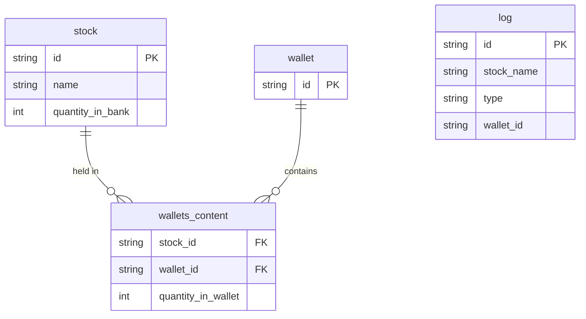

# Technical Documentation

## Tech Stack

- **Language:** Java 21
- **Build tool:** Gradle
- **Framework:** Spring Boot
- **Database:** PostgreSQL (hosted via Docker Compose)
- **Deployment:** Docker container

## Project Structure

```
.
├── src/
│   └── main/
│       ├── java/com/example/simplifiedstockmarket/
│       │   ├── controller/       # REST controllers and DTOs
│       │   ├── exceptions/       # Custom exception classes
│       │   ├── mapper/           # MapStruct mappers (entity ↔ DTO)
│       │   ├── model/            # JPA entity classes
│       │   ├── repository/       # Spring Data JPA repositories
│       │   └── service/          # Business logic
│       └── resources/
│           └── application.yaml  # App configuration
├── doc/
│   ├── task_for_intership_2026.md
│   ├── my_assumptions.md
│   └── database_diagram.png
├── Dockerfile
├── docker-compose.yml
├── build.gradle
├── build_and_run.sh   # Builds images and starts containers
├── start.sh           # Starts existing containers
├── stop.sh            # Stops running containers
└── remove.sh          # Removes containers and cleans up volumes
```

## Database Schema



## Concurrency

The system is designed to handle concurrent requests safely across multiple app instances sharing a single PostgreSQL database.

All critical write operations (`buy`, `sell`, `POST /stocks`) use `@Transactional` with pessimistic locking (`SELECT FOR UPDATE`) to prevent race conditions. This ensures that:

- Two simultaneous `buy` requests for the last available stock cannot both succeed.
- A `POST /stocks` request that would make it impossible to fulfill existing wallet holdings is rejected atomically.
- The audit log reflects only operations that fully committed.

The database is the single source of truth for concurrency control — no in-memory locking is used, which allows the system to scale horizontally across instances.

## REST API

---

### `POST /wallets/{wallet_id}/stocks/{stock_name}`

Simulates a buy or sell of a single unit of a stock. Bulk operations are not supported.

**Request body:**
```json
{ "type": "buy" | "sell" }
```

**Behaviour:**
- If the wallet does not exist, it is created automatically.
- If the stock does not exist in the bank, returns `404`.
- On `buy`: if there is no stock available in the bank, returns `400`.
- On `sell`: if the wallet does not hold the specified stock, returns `400`.
- On success, returns `200`.

---

### `GET /wallets/{wallet_id}`

Returns the current state of a wallet.

**Response:**
```json
{
  "id": "12qdsdadsa",
  "stocks": [
    { "name": "stock1", "quantity": 99 },
    { "name": "stock2", "quantity": 1 }
  ]
}
```

**Behaviour:**
- If no wallet with the given ID exists, returns `400`.

---

### `GET /wallets/{wallet_id}/stocks/{stock_name}`

Returns the quantity of a specific stock held in a specific wallet.

**Response:** a single integer, e.g. `99`

**Behaviour:**
- If no wallet with the given ID exists, returns `400`.
- If the given stock does not exist in the bank, returns `400`.

---

### `GET /stocks`

Returns the current state of the bank.

**Response:**
```json
{
  "stocks": [
    { "name": "stock1", "quantity": 99 },
    { "name": "stock2", "quantity": 1 }
  ]
}
```

---

### `POST /stocks`

Sets the state of the bank.

**Request body:**
```json
{
  "stocks": [
    { "name": "stock1", "quantity": 99 },
    { "name": "stock2", "quantity": 1 }
  ]
}
```

**Behaviour:**
- On success, returns `200`.
- If the requested state would make it impossible to sell stocks already held in wallets (i.e. the new stocks in the bank do not contain stocks already in wallets), returns `400`.

---

### `GET /log`

Returns the full audit log in order of occurrence. Only successful operations are logged.

**Response:**
```json
{
  "log": [
    { "type": "buy",  "wallet_id": "23qdsadsa",  "stock_name": "cbdadsa" },
    { "type": "sell", "wallet_id": "12qdsdadsa", "stock_name": "cbdadsa" }
  ]
}
```

---

### `POST /chaos`

Kills the instance that serves this request.

---

## Tests

Tests are implemented as shell scripts that send `curl` requests to a running instance. The `run_tests.sh` script prepares a clean environment using `stop.sh` and `start.sh` before executing the suite.

This approach was chosen because testing during development was done through Insomnia, an external HTTP client, so the test suite mirrors that workflow rather than using a Java testing framework.

The suite covers happy-path flows, error cases, and two concurrency scenarios (`test_12` and `test_13`) that verify the system correctly rejects operations that would violate stock availability under parallel load.

To run the tests:
```bash
chmod +x ./tests/run_tests.sh
chmod +x ./build_and_run.sh

./build_and_run.sh 8081 8082 8083
./tests/run_tests.sh
```