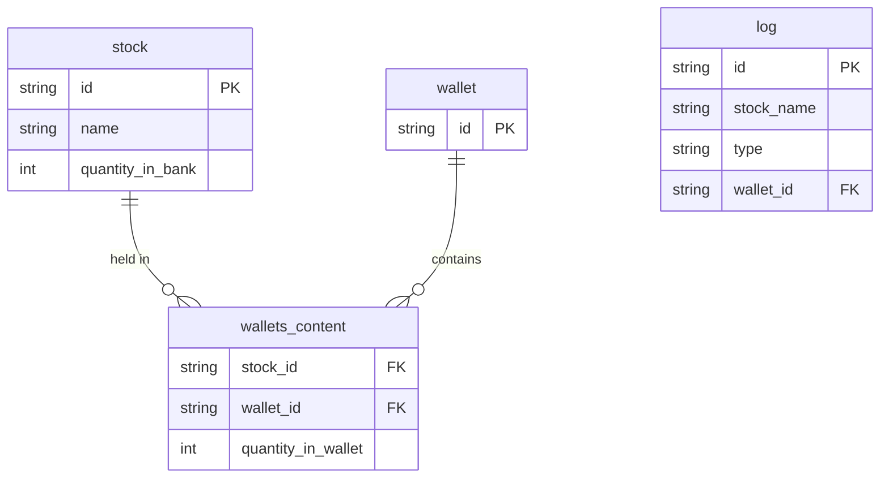

# App Technical Brief

## Tech Stack
App is write in Java 26,
Gradle dependecies manager
Springboot framework
Postgres SQL host in docker compose
App can be host in docker container.

## App Structure
```azure
.
├── build
│   ├── classes
│   │   └── java
│   │       └── main
│   │           └── com
│   │               └── example
│   │                   └── simplifiedstockmarket
│   │                       ├── controller
│   │                       │   ├── BankController.class
│   │                       │   ├── dto
│   │                       │   │   ├── LogDto.class
│   │                       │   │   ├── LogListDto.class
│   │                       │   │   ├── OperationType.class
│   │                       │   │   ├── StockDto.class
│   │                       │   │   ├── StockStatusRequest.class
│   │                       │   │   ├── WalletOperationRequest.class
│   │                       │   │   └── WalletStatusDto.class
│   │                       │   ├── GlobalExceptionHandler.class
│   │                       │   └── WalletController.class
│   │                       ├── DataInitializer.class
│   │                       ├── exeptions
│   │                       │   ├── InsufficientStockException.class
│   │                       │   ├── StockInUseException.class
│   │                       │   ├── StockNotFoundException.class
│   │                       │   └── WalletNotFoundException.class
│   │                       ├── mapper
│   │                       │   ├── LogMapper.class
│   │                       │   ├── LogMapperImpl.class
│   │                       │   ├── StockMapper.class
│   │                       │   └── StockMapperImpl.class
│   │                       ├── model
│   │                       │   ├── Log.class
│   │                       │   ├── LogType.class
│   │                       │   ├── Stock.class
│   │                       │   ├── Wallet.class
│   │                       │   ├── WalletsContent.class
│   │                       │   └── WalletsContentID.class
│   │                       ├── repository
│   │                       │   ├── LogRepository.class
│   │                       │   ├── StockRepository.class
│   │                       │   ├── WalletContentRepository.class
│   │                       │   └── WalletRepository.class
│   │                       ├── service
│   │                       │   ├── AuditService$1.class
│   │                       │   ├── AuditService.class
│   │                       │   ├── BankService.class
│   │                       │   ├── WalletService$1.class
│   │                       │   └── WalletService.class
│   │                       └── SimplifiedstockmarketApplication.class
│   ├── generated
│   │   └── sources
│   │       ├── annotationProcessor
│   │       │   └── java
│   │       │       └── main
│   │       │           └── com
│   │       │               └── example
│   │       │                   └── simplifiedstockmarket
│   │       │                       └── mapper
│   │       │                           ├── LogMapperImpl.java
│   │       │                           └── StockMapperImpl.java
│   │       └── headers
│   │           └── java
│   │               └── main
│   ├── reports
│   │   └── problems
│   │       └── problems-report.html
│   ├── resources
│   │   └── main
│   │       ├── application.yaml
│   │       ├── static
│   │       └── templates
│   └── tmp
│       └── compileJava
│           ├── compileTransaction
│           │   ├── backup-dir
│           │   └── stash-dir
│           └── previous-compilation-data.bin
├── build_and_run.sh
├── build.gradle
├── doc
│   ├── database_diagram.png
│   ├── my_assumptions.md
│   └── task_for_intership_2026.md
├── docker-compose.yml
├── Dockerfile
├── gradle
│   └── wrapper
│       ├── gradle-wrapper.jar
│       └── gradle-wrapper.properties
├── gradlew
├── gradlew.bat
├── HELP.md
├── README.md
├── remove.sh
├── settings.gradle
├── src
│   ├── main
│   │   ├── java
│   │   │   └── com
│   │   │       └── example
│   │   │           └── simplifiedstockmarket
│   │   │               ├── controller
│   │   │               │   ├── BankController.java
│   │   │               │   ├── dto
│   │   │               │   │   ├── LogDto.java
│   │   │               │   │   ├── LogListDto.java
│   │   │               │   │   ├── OperationType.java
│   │   │               │   │   ├── StockDto.java
│   │   │               │   │   ├── StockStatusRequest.java
│   │   │               │   │   ├── WalletOperationRequest.java
│   │   │               │   │   └── WalletStatusDto.java
│   │   │               │   ├── GlobalExceptionHandler.java
│   │   │               │   └── WalletController.java
│   │   │               ├── DataInitializer.java
│   │   │               ├── exeptions
│   │   │               │   ├── InsufficientStockException.java
│   │   │               │   ├── StockInUseException.java
│   │   │               │   ├── StockNotFoundException.java
│   │   │               │   └── WalletNotFoundException.java
│   │   │               ├── mapper
│   │   │               │   ├── LogMapper.java
│   │   │               │   └── StockMapper.java
│   │   │               ├── model
│   │   │               │   ├── Log.java
│   │   │               │   ├── LogType.java
│   │   │               │   ├── Stock.java
│   │   │               │   ├── Wallet.java
│   │   │               │   ├── WalletsContentID.java
│   │   │               │   └── WalletsContent.java
│   │   │               ├── repository
│   │   │               │   ├── LogRepository.java
│   │   │               │   ├── StockRepository.java
│   │   │               │   ├── WalletContentRepository.java
│   │   │               │   └── WalletRepository.java
│   │   │               ├── service
│   │   │               │   ├── AuditService.java
│   │   │               │   ├── BankService.java
│   │   │               │   └── WalletService.java
│   │   │               └── SimplifiedstockmarketApplication.java
│   │   └── resources
│   │       ├── application.yaml
│   │       ├── static
│   │       └── templates
│   └── test
│       └── java
│           └── com
│               └── example
│                   └── simplifiedstockmarket
│                       └── SimplifiedstockmarketApplicationTests.java
├── start.sh
├── stop.sh
└── TECHNICAL.md
```

## 📊 DataBase Schema



## Rest API

1. POST /wallets/{wallet\_id}/stocks/{stock\_name}
    - body: {type: “sell|buy”}
    - simulates sell or buy of a single stock, we don’t support bulk operations,
    - if the stock doesn’t exist this return 404
    - If there is no stock in the bank buy fail with 400
    - if there is no stock in the wallet sell fail with 400
    - If the operation succeeds it should return 200
    - if the wallet doesn’t exist this operation create it
2. GET /wallets/{wallet\_id}
    - response: {id: “12qdsdadsa”, stocks: \[{“name”:”stock1”, “quantity”:99}, {“name”:”stock2”, “quantity”:1}...\]}
    - returns current state of the particular wallet
    - is there is no wallet of given id fail with 400
3. GET /wallets/{wallet\_id}/stocks/{stock\_name}
   - returns a single number, like: 99
   - returns quantity of the specified stock in the specified wallet
   - is there is no wallet of given id fail with 400
4. GET /stocks
   - response: {stocks: \[{“name”:”stock1”, “quantity”:99}, {“name”:”stock2”, “quantity”:1}...\]}
   - returns current state of the bank
5. POST /stocks
   - body: {stocks: \[{“name”:”stock1”, “quantity”:99}, {“name”:”stock2”, “quantity”:1}...\]}
   - sets the state of the bank
   - If the operation succeeds it should return 200
   - if given request will set a status that make it imposible to sell stock that are already in wallets then fail with 400
6. GET /log
   - response: {log: \[{“type”:”buy”, “wallet\_id”:”23qdsadsa”, “stock\_name”:”cbdadsa”}, {“type”:”sell”, “wallet\_id”:”12qdsdadsa”, “stock\_name”:”cbdadsa”\]...}
   - returns entire audit log in order of occurrence
   - should log only successful operations
   - there will be no more 10000 operations
7. POST /chaos
   - Kills an instance that serves this request.
   - This DO NOT stop the working cointainer, just make it useles.